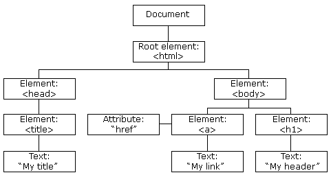
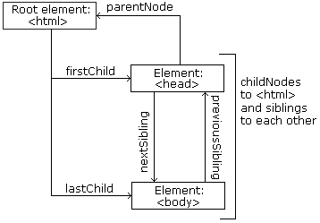

```{r,setup, include=FALSE}
library(knitr)
hook_output = knit_hooks$get('output')
knit_hooks$set(output = function(x, options) {
  # this hook is used only when the linewidth option is not NULL
  if (!is.null(n <- options$linewidth)) {
    x = knitr:::split_lines(x)
    # any lines wider than n should be wrapped
    if (any(nchar(x) > n)) x = strwrap(x, width = n)
    x = paste(x, collapse = '\n')
  }
  hook_output(x, options)
})

knitr::opts_chunk$set(cache = FALSE, message = FALSE,
                      linewidth = 50)
```

## Lecture Objectives

  - Scrape data using XPath and understand its basic components
  - Compare and contrast CSS selectors and XPath

## Motivation

  - Last week, we discussed how to extract data from HTML files.
  - We focused on CSS selectors, which is a way to identify which element we want.
  - However, we also saw that sometimes it extracts more information than we need.
    + E.g. Tables from Wikipedia all have the same class.
  - **XPath** is a powerful and more precise way of describing a specific element inside an HTML file
    + E.g. It also applies to XML files more generally.
    
## Example {.allowframebreaks}

```{r}
# From last week----
library(rvest)
library(tidyverse)

url <- "https://en.wikipedia.org/wiki/World_population"
world_pop_tables <- read_html(url) %>% 
  html_elements("table.wikitable") 

length(world_pop_tables)
```

```{r}
# Notice the single and double quotes!
xpath <- '//div[@id="mw-content-text"]/div[1]/table[4]'
exact_table <- read_html(url) %>% 
  html_element(xpath = xpath)

library(knitr)
html_table(exact_table) %>% 
  select(Rank, Country, Population) %>% 
  kable()
```

## XPath---Basic syntax {.allowframebreaks}

  - **XPath** uses path expressions (think "file system") to select elements in an HTML document.
  - We can specify paths:
    + based on element names (e.g. `div` or `p`)
    + based on element attributes (e.g. `class` or `href`)
    + based on an element's relationship to other elements (e.g. `p` inside `div`)
  - Let's look at the path we used earlier
    + `//div[@id="mw-content-text"]/div[1]/table[4]`
  - You probably recognize some of the elements here (`div` and `table`).
  - But what do the other pieces mean?
  


 

  - In other words, XPath cares about:
    + The type of element and its attributes (just like CSS selectors)
    + The ancestor/descendant relationship between elements (in a more refined way than CSS selectors)
    + The child order within a generation (this is new!)
  - With all of this, we can create very specific search strings in a way CSS selectors simply can't.
  
\vspace{2cm}
  
  - Going back to our XPath example: `//div[@id="mw-content-text"]/div[1]/table[4]`
    + `div[@id="mw-content-text"]` matches a `div` with a specific `id`.
    + `div[1]` matches the first `div` child of the previous element.
    + `table[4]` matches the fourth `table` child of the previous element.
    + The starting `//` means this match could occur anywhere in the HTML document.
    
## Exercise

<center> 
On https://www.r-project.org/mail.html, you can find a list of *Special Interest Group* mailing lists. Create an XPath that will match all `a` elements from this list, and no other ones.

**Hint**: Open up the developer tools, start from `/html/body` and go from there.
</center>

## Solution {.allowframebreaks}

```{r}
library(rvest)

url <- "https://www.r-project.org/mail.html"
path <- "/html/body/div/div[1]/div[2]/ul[1]/li/p/a"

mail <- read_html(url) %>% 
    html_elements(xpath = path)
```

```{r}
library(tidyverse)

data.frame(
    name = html_text(mail),
    URL = html_attr(mail, "href")
) %>% glimpse
```

```{r}
# Equivalently: once we reach ul[1]
# we want all a elements
path2 <- "/html/body/div/div[1]/div[2]/ul[1]//a"

mail2 <- read_html(url) %>% 
    html_elements(xpath = path)

# Are they the same?
all.equal(mail, mail2)
```

## Axis specifiers

| Expression | Description |
|------------|-------------|
| `@`  | Extract an attribute |
| `.`  | Refers to current node |
| `..` | Refers to (direct) parent node |
| `\\` | Refers to direct or indirect children |

## Example {.allowframebreaks}

  - On https://coinmarketcap.com/all/views/all/, there is a table with information about crypto-currencies.
  - Let's extract this data and find the top 5 crypto-currencies with respect to their price (in USD).
  - We can see our `table` of interest is inside a `div` of class `cmc-table__table-wrapper-outer`
  
```{r}
library(tidyverse)
url <- "https://coinmarketcap.com/all/views/all/"
path <- paste0('//div[@class="cmc-table__',
               'table-wrapper-outer"]/div/table')

data <- read_html(url) %>% 
    html_element(xpath = path) %>% 
    html_table()
glimpse(data)
```

```{r}
# Clean up Price so we can order it
# NOTE: there's a column name missing
# which can cause some weird errors
library(stringr)
data %>% 
    select(Name, Symbol, Price) %>% 
    mutate(Price = str_replace_all(Price, "\\$|,", ""),
           Price = as.numeric(Price)) %>% 
    top_n(5, Price)
```


## Exercise

<center>
On https://en.wikipedia.org/wiki/List_of_cognitive_biases, you can find multiple tables about cognitive biases. Focusing on social biases, extract the link to the different biases (i.e. from the first column). Be careful not to extract the other links (you should have 42 links).

**Bonus**: Using these links, extract the list of references for each social cognitive bias.
</center>

## Solution {.allowframebreaks}

  - First, we observe that our table of interest is the second `table` inside a `div`: `//div/table[2]`
  - Next, we see that inside the table, each bias is organized into a row (`tr`), and that within a row, we want to focus on the first entry (`td[1]`). The `a` element we want is there, which gives us `tr/td[1]/a`.
  - This second piece is an indirect child of the first piece, so we have our path: `//div/table[2]//tr/td[1]/a`

```{r}
url <- paste0("https://en.wikipedia.org/wiki/",
              "List_of_cognitive_biases")
path <- "//div/table[2]//tr/td[1]/a"

list_links <- read_html(url) %>% 
  html_elements(xpath = path) %>% 
  html_attr("href")
```


```{r}
str(list_links)
```

  - For the references, note that they are stored in an ordered list (`ol`) of class `references`, and each citation is inside a special `cite` element.
    + The XPath we need is `//ol[@class="references"]//cite`
    
```{r}
# It's a good idea to test before looping
path_ref <- '//ol[@class="references"]//cite'

paste0("https://en.wikipedia.org/", 
       list_links[1]) %>% 
  read_html() %>% 
  html_elements(xpath = path_ref) %>% 
  html_text() %>% 
  str()
```

```{r}
# Write a function
extract_refs <- function(url) {
  paste0("https://en.wikipedia.org/", 
         url) %>% 
  read_html() %>% 
  html_elements(xpath = path_ref) %>% 
  html_text()
}
```


```{r}
# Double check
extract_refs(list_links[1]) %>% 
  str
```

```{r ref-extract, cache = TRUE}
# Loop over all links----
library(purrr)

full_refs <- map(list_links, 
                 extract_refs)

# full_refs is a list
length(full_refs)
```

## Summary 

  - XPath gives us more flexibility than CSS selectors by focusing on the relationship between elements.
  - Some developer tools can give you an XPath for a specific element---look up online for more details!
  - XPath is a lot more complex than we have time to discuss.
    + In fact, XPath is a Turing-complete (query) language.
