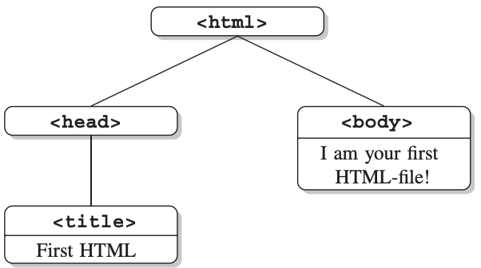

```{r,setup, include=FALSE}
library(knitr)
hook_output = knit_hooks$get('output')
knit_hooks$set(output = function(x, options) {
  # this hook is used only when the linewidth option is not NULL
  if (!is.null(n <- options$linewidth)) {
    x = knitr:::split_lines(x)
    # any lines wider than n should be wrapped
    if (any(nchar(x) > n)) x = strwrap(x, width = n)
    x = paste(x, collapse = '\n')
  }
  hook_output(x, options)
})

knitr::opts_chunk$set(cache = FALSE, message = FALSE,
                      linewidth = 50)
```

## Lecture Objectives

  - Understand the basics of HTTP, URLs, and HTML
  - Extract data from HTML documents using CSS selectors

## Motivation

  - There's lots of data on the Internet...
    + It's estimated that there are over 1 trillion websites around the world.
  - Some information is easy to capture and copy-paste to CSV file.
    + E.g. a nicely formatted table on Wikipedia.
  - More often, data is spread over multiple pages, and not stored in nice tables.
  - **Web scraping** is the (automated) process of extracting data from the web.
  
## Crash course on HTTP {.allowframebreaks}

  - HTTP: Hypertext Transfer Protocol
  - It's the standard way of communicating over the web.
    + But not the only way! Email uses other protocols (e.g. POP, SMTP, IMAP).
    + Pages you read, images you see, videos you watch are sent to your web browser using HTTP.
  - When you want to visit a website, your web browser sends a **request** for content to a web server, and the server sends back a **response**.
    + To see a single page, you typically perform multiple requests.
  - There are six different types of requests you can make, but we will focus on only two:
    + `GET`: Client asks for a resource from the server.
    + `POST`: Client also asks for a resource, but sends data at the same time (e.g. inputs from an HTML form).
  - The server will then send back a response:
    + Contains a status code (e.g. `404` means resource is unavailable).
    + Contains information about the type of content being sent over (e.g. images, videos, HTML)
    + The actual content we asked for.
    
## Identifying resources {.allowframebreaks}

  - The standard way of identifying which resource we want is by using a **Uniform Resource Locator** (URL).
  - The general syntax is as follows:
  
```
scheme://hostname:port/path?querystring#fragment
```

  - The *scheme* is typically either HTTP or HTTPS (but could also be FTP).
  - The *hostname* is the name of the host, e.g. `www.ecosia.org` or `www.nytimes.com`.
  - The *port* is the "door" on the server through which the communication occurs. The default is 80, and it is usually omitted.
  - The *path* is the location of the resource, e.g. `2021/03/15/movies/oscars-nominees-list.html`.
  - The *query string* is a series of `name=value` pairs separated by an ampersand (&) 
    + `https://www.ecosia.org/search?q=web+scraping`
    + `q=web+scraping&freshness=month` would further restrict to results to past month.
  - The *fragment* points to a specific part of the returned output (usually an HTML file). It doesn't change what the server sends, only how the browser displays it.
  
## Example {.allowframebreaks}

```{r}
library(httr)
resource <- GET("https://www.ecosia.org")
resource$status_code
http_status(resource)
```

```{r}
# What did we receive?
resource$headers$`content-type`
content(resource)
```

```{r}
# What about images?
url <- paste0("https://www.maxturgeon.ca/", 
              "figure/posts/oscar2019_bestPic.png")
image <- GET(url)
image$status_code
image$headers$`content-type`
str(content(image))
```

## Browser developer tools

  - Most modern browsers allow you to check what HTTP requests have been sent using their developer tools.
    + Safari requires you to first enable the menu (you can find instructions online).
  - Live demo with `https://www.ecosia.org`
  
## HTML documents

  - By far, the most common documents we will scrape for data are **HTML** documents.
    + HTML: Hypertext Markup Language
  - HTML is a language for presenting content on the Web. 
    + HTML is a special case of XML (Extended Markup Language).
  - HTML structures content within **tags**.
  - These tags form a tree-like structure (i.e. tags are embedded into one another).
  - Some elements in the tree are also given attributes to distinguish them from elements with the same tags.
    + E.g. `class="happy"` or `id="movie-1`
  
## HTML documents---Tree structure

<center>

</center>

Munzert *et al*, *Automated Data Collection with R* 

## Example

```{r}
library(tidyverse)
content(resource, as = "text") %>%
  str_extract("<title>[\\w\\s-]*</title>")
```

## Most common HTML tags {.allowframebreaks}

  - **Anchor elements**: They are used to link to other documents/web pages, setting reference points, or linking to reference points.
  
```
<a href="en.wikipedia.org/wiki/List_of_pharaohs">Link 
with absolute path</a>
```

  - **Paragraph tag**: Create paragraphs of text

```
<p>This text is going to be a paragraph one day and 
separated from other text by line breaks.</p>
```

\vspace{2cm}

  - **Heading tags**: HTML provides 6 levels of headings
  
```
<h1>heading of level 1 -- this will be BIG</h1>
<h2>heading of level 2 -- this will be big</h2>
...
<h6>heading of level 6 -- the smallest heading</h6>
```

\vspace{4cm}

  - **Listing tags**: Both ordered (`<ol>`) and unordered (`<ul>`) lists
  
```
<ul>
  <li>Dogs</li>
  <li>Cats</li>
  <li>Fish</li>
</ul>
```

\vspace{2cm}

  - **Dividing tags**: Allows to organize sections (or subtrees) of the HTML document
  
```
<div class="happy">
  <p>One paragraph</p>
</div>
```

\vspace{4cm}

  - **Table tags**: Used to create tables (which usually contain data!)
  
```
<table>
<tr> <th>Rank</th> <th>Name</th> </tr>
<tr> <td>1</td> <td>Lichtenstein</td> </tr>
<tr> <td>2</td> <td>Monaco</td> </tr>
<tr> <td>3</td> <td>Luxembourg</td> </tr>
<tr> <td>4</td> <td>Norway</td> </tr>
<tr> <td>5</td> <td>Qatar</td> </tr>
</table>
```

## Example

```{r}
# List of pharaohs in tables
# en.wikipedia.org/wiki/List_of_pharaohs
GET("en.wikipedia.org/wiki/List_of_pharaohs") %>% 
  content(as = "text") %>% 
  str_extract_all("<table>")
```

## Example Redux {.allowframebreaks}

```{r}
# List of pharaohs in tables
# en.wikipedia.org/wiki/List_of_pharaohs
GET("en.wikipedia.org/wiki/List_of_pharaohs") %>% 
  content(as = "text") %>% 
  str_extract_all("<table class=\"wikitable\".*>") %>% 
  str()
```

## CSS selectors

  - We need a better way to find what we are looking for within an HTML document.
    + Remember: HTML is a text file, but it also has a tree structure. 
  - Moreover, important HTML elements are often identified using `class` or `id` attributes.
    + So that they can be styled using CSS
  - We can use this to our advantage to extract the data we want.
  
## Example {.allowframebreaks}

```{r}
library(rvest)

read_html("https://www.ecosia.org") %>% 
  html_elements("title") %>% 
  html_text() # Get text from element
```

```{r}
# Syntax: tag.class
url <- "https://en.wikipedia.org/wiki/List_of_pharaohs"
tables <- read_html(url) %>% 
  html_elements("table.wikitable")
length(tables)
```

```{r}
# Let's look at first one
tables[[1]]

html_table(tables[[1]]) %>% 
  glimpse
```


## Exercise

<center>

{width=50%}

</center>

Using CSS selectors, extract the salaries from 

https://www.macleans.ca/education/uniandcollege/top-10-highest-paid-university-officials-in-canada/

*Hint*: Salaries (and more) are in a `div` of class `single-article-text`.

## Solution {.allowframebreaks}

```{r}
library(rvest)
url <- paste0("https://www.macleans.ca/education/",
              "uniandcollege/top-10-highest-paid-",
              "university-officials-in-canada/")
data <- read_html(url) %>% 
  html_elements("div.single-article-text") %>% 
  html_elements("p") %>% 
  html_text() 
```

```{r}
library(tidyverse)
data <- data.frame(text = data)
glimpse(data)
```

```{r}
data_clean <- data %>% 
  filter(str_detect(text, "^\\d{1,2}\\.")) %>% 
  separate(col = "text", into = c("name", "salary"), 
           sep = "\\n") %>% 
  mutate(name = str_replace(name, 
                            "^\\d{1,2}\\.\\s*", ""), 
         salary = str_extract(salary, "\\$[\\d,]+$"))
glimpse(data_clean)
```

```{r}
library(knitr)
kable(data_clean)
```

## Summary

  - HTTP is the main way we ask for content from web servers.
    + And most of this content is HTML pages.
  - HTML pages contain lots of information, but it can be difficult to parse.
  - CSS selectors allow us to pick out exactly the pieces we want.
  - It's very common to use regular expressions to clean up the data as it's collected.
