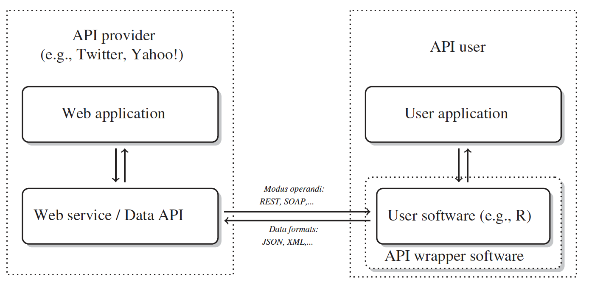
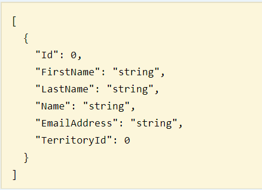

```{r setup, include=FALSE}
library(knitr)
hook_output = knit_hooks$get('output')
knit_hooks$set(output = function(x, options) {
  # this hook is used only when the linewidth option is not NULL
  if (!is.null(n <- options$linewidth)) {
    x = knitr:::split_lines(x)
    # any lines wider than n should be wrapped
    if (any(nchar(x) > n)) x = strwrap(x, width = n)
    x = paste(x, collapse = '\n')
  }
  hook_output(x, options)
})

knitr::opts_chunk$set(cache = FALSE, message = FALSE,
                      linewidth = 50)
```

## Lecture Objectives

  - Access APIs from `R`
  - Learn basics of JSON
  - Compare and contrast web scraping and APIs

## Motivation

  - Last week, we talked a bit about the ethics of web scraping.
    + It uses server resources, so we have to be respectful.
  - Some web sites provide a way to interact with their data using **APIs**.
  - APIs provide a documented way of accessing data, and web sites can control access.
    
## Main definitions

  - **API**: Application Programming Interface
    + Allows us to interact with a web application using a programming language.
  - **REST**: Representational State Transfer
    + Resources are referenced via URLs and their representations (i.e. data) is transferred via an HTTP request
  - An API following the REST standard is called a **RESTful API**.
    
## Why would a website provide an API?



<center>
*Automated Data Collection in R*
</center>

## Pros/Cons

  - Advantages
    + Documentation on how to access data
    + Structured data
    + Respectful of server-side resources
  - Disadvantages
    + May not include the data you want/need
    + Not always free

## Example {.allowframebreaks}

  - Colorado has a lot of data available: https://data.colorado.gov
  - We will focus on their population projections: https://data.colorado.gov/Demographics/Population-Projections-in-Colorado/q5vp-adf3
  - Looking at the documentation, we see we can specify the county.
    + Using URL parameters!

```{r}
library(httr)
# Base URL path
base_url <- paste0("https://data.colorado.gov/",
                   "resource/q5vp-adf3.json?")
full_url <- paste0(base_url, "county=Boulder")

data <- GET(full_url)
status_code(data) # 200 OK

# What did we receive?
data$headers$`content-type`
```

## JSON {.allowframebreaks}

  - **JSON**: Javascript Object Notation
  - It's a common way to share structured data across the web in a human-readable format.
  - `Key: value` pairs, grouped using curly braces.
  - Main idea: Easy to read and write for both humans and computers.
    + And we have `R` packages to transform them JSON data into `data.frame`s

<center>

</center>

## Example (cont'd) {.allowframebreaks}

```{r}
library(tidyverse)
library(jsonlite)

data <- fromJSON(content(data, as = "text"))
is.data.frame(data)
names(data)
```

  - We can also filter the data using URL parameters
    + https://dev.socrata.com/docs/queries/
  - **Note**: We need to properly encode the URL first, as it contains spaces.

```{r tidy = TRUE, tidy.opts = list(width.cutoff = I(60))}
# We can filter the data via the URL
full_url <- paste0(base_url, "county=Boulder",
                   "&$where=age between 20 and 40")
# Need to encode to proper URL
full_url <- URLencode(full_url)
# Spaces are replaced by %20
str_sub(full_url, 66)
```

```{r}
data <- GET(full_url)
status_code(data) # 200 OK
data <- fromJSON(content(data, as = "text"))
range(as.numeric(data$age))
```

## Exercise

<center>
Look at the documentation here: https://dev.socrata.com/docs/queries/

Build a URL that will select the following three variables: `year`, `age`, `femalepopulation`; and where `age` is constrained to be between 20 and 40 years old (see previous example).

Use the returned data to plot population projections over time.
</center>

## Solution {.allowframebreaks}

  - Looking at the documentation, we can use `$select=year,age,femalepopulation` as an URL parameter to select the variables we want.

```{r}
full_url <- paste0(base_url, "county=Boulder",
                  "&$where=age between 20 and 40",
                  "&$select=year,age,femalepopulation")

full_url <- URLencode(full_url)
```


```{r}
data <- GET(full_url)
status_code(data) # 200 OK
data <- fromJSON(content(data, as = "text"))
```

```{r eval = TRUE}
library(tidyverse)
# Mutate variables to numeric
data <- data %>% 
  mutate(year = as.numeric(year),
       age = as.integer(age),
       femalepopulation = as.numeric(femalepopulation))

data %>% 
  ggplot(aes(x = year, y = femalepopulation)) +
  geom_line(aes(group = age, colour = age))
```

## Example {.allowframebreaks}

  - We will interact with the Winnipeg Transit API.
    + This example is adapted from their web site: https://api.winnipegtransit.com/home/api/v3/example
  - To access the API you need to register, and you will receive an API key.
  - We will start by finding the nearby stops
    + We need to pass longitude (`lon`) and latitude (`lat`) coordinates
    + We need to pass a radius `distance` within which to look for nearby stops.

```{r}
# Retrieve API key from environment variable
token <- Sys.getenv("WINNIPEG_TOKEN")

baseurl <- paste0("https://api.winnipegtransit.com/",
                  "v3/stops.json?")

full_url <- paste0(baseurl, "lon=-97.138&lat=49.895&", 
                   "distance=250&", "api-key=", token)
```


```{r}
data <- GET(full_url)
status_code(data) # 200 OK
data <- fromJSON(content(data, as = "text"))
```

```{r}
names(data)
glimpse(data$stops)
pull(data$stops, name)
```

  - Next, we can pull the stop schedules.
  - Each stop has a different endpoint.
    + E.g. for stop 10541, we query `stops/10541`
  - We also specify the `max-results-per-route`.

```{r}
base_url <- paste0("https://api.winnipegtransit.com/",
                   "v3/stops/10541/schedule.json")
full_url <- paste0(base_url, 
                   "?max-results-per-route=2&",
                   "api-key=", token)

data <- GET(full_url)
status_code(data) # 200 OK
data <- fromJSON(content(data, as = "text"))
```

```{r}
library(purrr)
data %>% 
  pluck("stop-schedule", "route-schedules",
        "scheduled-stops", 1, "times", "arrival")
```

  - **Bonus exercise**: Transform `data` into a table with three columns: Route name, Expected Arrival, and Estimated Arrival.

## APIs and `R` packages

  - `R` packages have been created to interact with most common APIs:
    + `rtweet`: Collecting Twitter data
    + `rnoaa`: NOAA weather data
    + `tradestatistics`: Open Trade international data

## Summary

  - Web sites use APIs to deliver data as needed, and they sometimes make APIs available to the public.
  - APIs often require registration (i.e. using a key) so that they can keep track of your usage.
    + Authentication is sometimes more complex; look at the documentation.
    + Some APIs are not free!
  - We should prefer API over scraping whenever possible, as it is more respectful of server resources.
